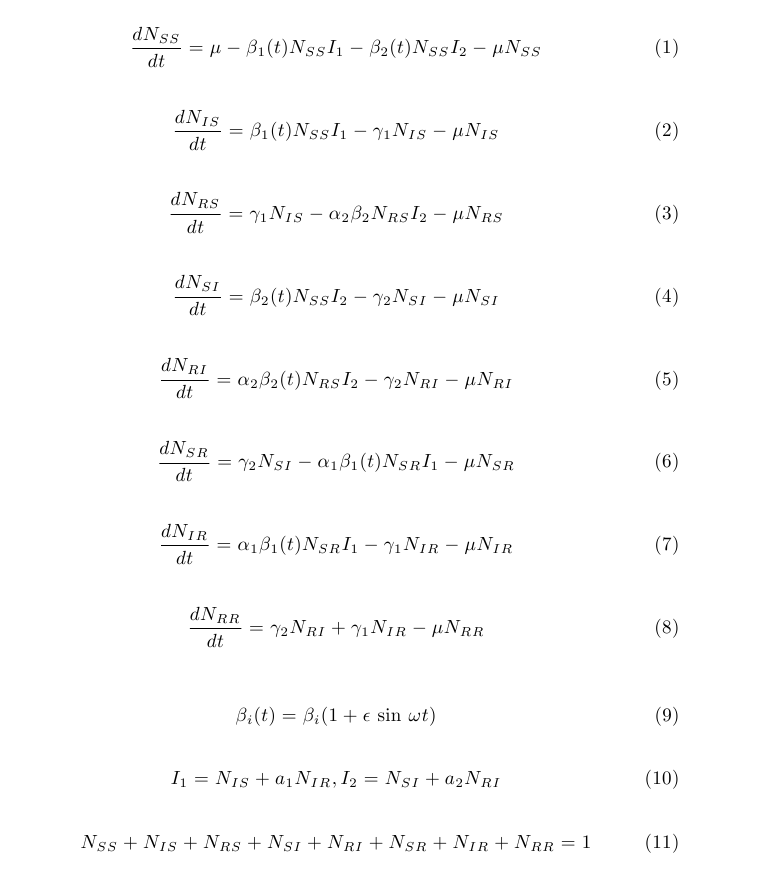
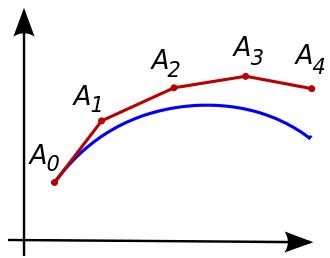
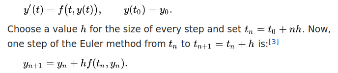
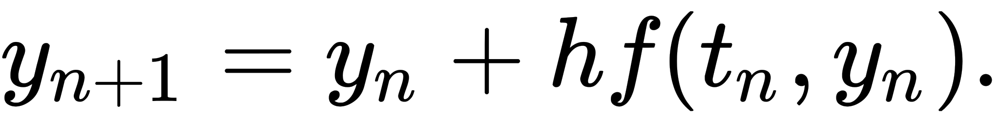

# Code Structure for Science
### How to write canonical software.

## Part 1: Foundation, Functional Programming, Separation of Concerns

## Prerequisites

Some coding experience. Understanding of basic control flow (functions, conditions, loops). Examples are in Python but concepts apply to any language.

## Dependencies

* Python 3 (optional)


## What does "code structure" refer to?

This module covers the basic motivation and techniques for constructing software applications, scripts, and analyses out of the basic building blocks in programming languages. This goes by many names: organization, design, or architecture. And there are many code qualities we often want to optimize: readability, maintainability, cleanliness, or modularity.

We will focus on the basic aspects of structuring code at a small scale, and minimizing a unifying quality _complexity._ We will ignore other purposes for studying architecture such as performance, and specific design patterns.


## Motivation

Complexity is one of the main barriers to code reuse. It inhibits the author's ability to produce the code, and the user's ability to understand and sometimes to run the code at all. In science, this phenomenon is even more acute since the stakes may be the applications effect on the scientific community and scientific knowledge.

At the far end of the spectrum of unmaintainable code is code that, practically speaking, won't run without the author's file formats, local environment, or know-how. As an application gets larger, the effect is compounded. Large applications are much, much more complex than small ones. As an application grows, it's common to hit a "wall" where progress becomes difficult or prohibitive.

There's also a sense in which a scientific application or library serves as a description of a process, and should, as a mathematical formula, be put in simplest, most canonical form.

All of these factors affect progress, and digital reproducibility in science.


## Theoretical Framework

The foundations of code organization go back to the foundations of computation, and Computer Science. For the purpose of this module, we'll rely on three important facts:

1. All computation can be modeled as operations on data.
2. All computation can be modeled as functions.
3. There are nearly unlimited ways to write a piece code that are equivalent (meaning the functionality, or input/output pairs is the same).

A simpler, and correct, way to put this is that all computing, and therefore programming, consists of functions (composed of smaller computations) operating on data.

### What does this mean, and why does it matter?

One source of complexity is the tendency of new programmers to think of the code they're writing in novel ways depending on the domain in which they're working, or what's convenient in a particular codebase. It may also be more difficult for a beginner programmer to deconstruct existing code, leading to great variety of patterns depending on what works at any given time.

The fact is that all code can be written in a very uniform way if you view it through a particular lens. Instead of variables with new names in each new project you take on, and functions that do things in novel ways, you can begin to see variables as data, and a series of functions that operate on that data.

Even operations that seem to need their own category, are actually the same. The `+` operator is just a function that takes two parameters. The expression `1 + 2` evaluates to 3, but so would a function `add` that does addition: `add(1, 2)`.

`1 < 2` evaluates to `True` but so would a function `less_than` that returns `True` if the first parameter is less than the second. Other structures are, and in fact have to be, rewriteable in this way.

We can also start to think about what we want from functions across all of our code to simplify anything we write, and make future changes easier as well (more on this later).


### Example

To take an extreme example, consider the following implementation of [Bayes' Rule](https://en.wikipedia.org/wiki/Bayes%27_theorem).

```python
pos_a = 3

occ_a = 2

p_of_a = occ_a / pos_a

pos_b = 4

occ_b = 3

p_of_b = occ_b / pos_b

p_of_a_and_b = p_of_a * p_of_b

p_of_b_given_a = p_of_a_and_b / p_of_b

p_of_a_given_occ_b = p_of_a_and_b / p_of_b * occ_a / pos_a

p_of_a_given_b = p_of_a_given_occ_b / p_of_b

print(p_of_a_given_b)

# ~ 0.59
```

This code is perfectly legitimate in that it runs and does something useful, computing 0.59. There are three problems with its code structure, however.

1. It only computes one thing with one set of numbers as input. The values are "hard coded" and there are no functions to call again with different values.
2. There's repetition for what seems to be the same algorithm (`p_of_b` and `p_of_a` are computed the same way). There's repetition of the same calculation `p_of_a_and_b / p_of_b`.
3. There's very little abstraction. Each line does one operation and only the variable names give an idea of the author's intention.
4. There are different "levels" of abstraction. `p_of_a_given_occ_b` goes back to using input values when it could be composed of "higher level" computations.

There is no need to think about this code in a novel way. We don't even need to know what it does to make it simpler and more understandable. We know that it can be composed of functions and data.

First, recognize that variables such as `pos_b` are data, and they're unchanged throughout so we can group them together at the beginning. We can think of them as separate from computation.

We can also remove any repetition of the same calculation. (This doesn't go back to the Theoretical Framework but it adds complexity and is very common. More on this in [DRY](#dont-repeat-yourself-dry). The issue of using different levels of abstraction is also fixed this way and can be thought of as an application of the DRY principle.)

```python
pos_a = 3
pos_b = 4

occ_a = 2
occ_b = 3

p_of_a = occ_a / pos_a

p_of_b = occ_b / pos_b

p_of_a_and_b = p_of_a * p_of_b

p_of_b_given_a = p_of_a_and_b / p_of_b

p_of_a_given_b_occ = p_of_b_given_a * p_of_a

p_of_a_given_b = p_of_a_given_b_occ / p_of_b

print(p_of_a_given_b)

# ~ 0.59
```


It's a little easier to understand already. Now let's generalize over some of the instances of division with a function `p`.

And now that we know that `p_of_a` and `p_of_b` are the result of the `p` computation we can change them to `A` and `B`.

```python
pos_a = 3
pos_b = 4

occ_a = 2
occ_b = 3

def p(num, denom):
    return num / denom

A = p(occ_a, pos_a)
B = p(occ_b, pos_b)

p_of_a_and_b = A * B

p_of_b_given_a = p_of_a_and_b / B

p_of_a_given_occ_b = p_of_b_given_a * A

p_of_a_given_b = p_of_a_given_occ_b / B

print(p_of_a_given_b)

```

So now it's clear that the intention of those division operations are meant to be probabilities. (Usually, we'll want to abstract more code at once since `p(x, y)` is not much simpler than `x / y`, if at all, but it illustrates the concept.)

Now we can abstract more code into a function. This will make these lines reusable: We've generalized over all computations of this type.

By using some logical replacement, replacing each variable in subsequent lines with its definition, we can start to combine the expressions.

```python
p_of_a_and_b = A * B

p_of_b_given_a = p_of_a_and_b / B

```

Becomes:

```python

p_of_b_given_a = A * B / B

```

Continuing that process leaves a very simple equation:

```python
pos_a = 3
pos_b = 4

occ_a = 2
occ_b = 3

def p(num, denom):
    return num / denom

A = p(occ_a, pos_a)
B = p(occ_b, pos_b)

p_of_a_given_b = A * B / B * A / B

print(p_of_a_given_b)

```

And finally, we make this a reusable function:


```python
def p(num, denom):
    return num / denom

def bayes_rule(A, B):
    return A * B / B * A / B

pos_a = 3
pos_b = 4

occ_a = 2
occ_b = 3

A = p(occ_a, pos_a)
B = p(occ_b, pos_b)

A_given_B = bayes_rule(A, B)

print(A_given_B)
```

For a more complex operation, supporting functions like `p` are helpful. Very complex processes can be written as trees of functions breaking work down into smaller and smaller pieces. For such a short function, and since the domain now is clear, `p` isn't necessary:

```python
def bayes_rule(A, B):
   return A * B / B * A / B

A = 2 / 3
B = 3 / 4

A_given_B = bayes_rule(A, B)

print(A_given_B)

```


Now consider this program:

```python
def calc(xy, ij):

    result = [None, None]

    for idx in [0, 1]:
        result[idx] = xy[idx] / ij[idx]

    first = 0
    second = 1
    return result[first] * result[second] / result[second] * result[first] / result[second]

array1 = [2, 3]
array2 = [3, 4]

print(calc(array1, array2))
```

It is identical to the previous program.

Again, we can use our lens to see the functions as a set of input/output pairs; operations on data. The exact code is not the "definition" of the program. The definition is the set of input/output pairs.

To convince ourselves further, let's do an experiment and generate random inputs and see if the functions' output is identical:


```python
from random import randint

def calc(xy, ij):

    result = [None, None]

    for idx in [0, 1]:
        result[idx] = xy[idx] / ij[idx]

    first = 0
    second = 1
    return result[first] * result[second] / result[second] * result[first] / result[second]

def bayes_rule(A, B):
   return A * B / B * A / B

for x in range(0, 1000):
    min = 1 # avoid div by zero
    max = 100

    pos_a = randint(min, max)
    occ_a = randint(min, max)

    pos_b = randint(min, max)
    occ_b = randint(min, max)

    assert bayes_rule(occ_a/pos_a, occ_b/pos_b) == calc([occ_a, occ_b], [pos_a, pos_b])
    print("Same!")
```

And they are. These two code snippets are examples of an endless number of ways the same functionality can be written.

Hopefully, this shows intuitively how guarantees from computational theory apply to everyday programming, and how code can be organized consistently throughout a program, and over programs in general.

Next we'll cover the range of individual functions and how they can be easier, or more difficult to reason about and maintain.


## Function Design

We know programs can be decomposed into functions and data. We know that by using this lens, we can organize programs around this dichotomy, and we're guaranteed to be able to do so. Now we can talk about how to optimize each function for minimum complexity.


### Scope

Most programming languages include the concept of scope. Scope is the section of source code in which a variable or function can be accessed. It is the place or places where a name is defined.

```python
def somefunc():
    a = 1
    return a + 1

print(somefunc())

# a will not be defined
a
```

If you run this code, you should get an error "name 'a' is not defined." This is because the variable `a` is defined in the function `somefunc` and undefined outside the scope of the function, meaning anywhere outside the body of the function.

This is very important for the ability to reason about programs. If `a` is not defined outside of the function, we don't need to think about it anywhere but inside the function. We can assume that, if our code compiles, there's no reference to `a` anywhere else, and there's no code that depends on `a`, or modifies it.

Conclusions about large programs often hinge on this logic.

Take the "replacement rule," used to simplify the Bayes program.

```python
p_of_a_and_b = A * B

p_of_b_given_a = p_of_a_and_b / B
```

is equivalent to:

```python
p_of_b_given_a = A * B / B
```

But what if `p_of_a_and_b` could be modified by a parallel process after it's initialized to `A * B` and before it's accessed in the next line?

What if we could modify a variable anywhere?

### Fig. A
```python
x = 3
y = 2
run_something()

print(x * y)
```

Lest we forget how malleable (and how large and complex) software can be, `run_something()` could be thousands of lines of code, and we would not be guaranteed of any `x * y` because `run_something` may have changed them. We certainly couldn't use the logic of replacement to replace `x` with `3` in the last line and be certain the output is unchanged.

_Note: In Python, `run_something` could modify `x` or `y` but they would need to be prefaced with `global` in the function._

The analogy in scientific publishing would be that a variable x in a complex scientific paper could be affected by other functions, not because they are involved in the computation of x, but because the functions were "nearby" x, or in the same paper as x. It's much more complex to understand some equations when everything depends on everything else, rather than when we're able to think about equations in isolation.

So scope is very important. It guarantees that we can isolate variables and make logical conclusions about them.


## The Range of Functions

Despite the fact that scopes prevent us from modifying variables outside their intended context, each scope can still be very complex. There is an unlimited number of variables in and outside of functions, and, with some small tweaks, the `x` and `y` above could be changed by some code in `run_something`.

Effort is required to keep individual scopes simple, and avoid changes or dependency on variables in other parts of a program. One of the easiest ways to do this, and a way that's guaranteed possible by the [theoretical framework](#theoretical-framework), is by favoring pure functions.


### Pure Functions

Pure functions are functions that have an input and an output (parameters, and return value). This is no different from other functions. However, the output of a pure function _only depends_ on the input. And, the function _only affects_ the output.

The way this is stated more formally is:

1. Pure functions always return the same output for an input. For instance:

```python
def f(x):
    return x + 2
```

always returns the corresponding `x + 2` for every `x` no matter the context and across time.


```python
from random import randint

def f(x):
    return x + randint(0, 10)
```

does not.

2. Pure functions have no side effects. The function can’t modify any variables outside itself.

```python
g = 0

def f(x):
    global g
    g = g + 1
    return x + 2
```

`f` modifies y, which is outside the scope of the function, so it is not pure.


Another way to describe pure functions, and their benefits, is to say that pure functions are [_referentially transparent_](https://en.wikipedia.org/wiki/Referential_transparency). You can replace the symbol (`p_of_a_and_b` in the previous example, or `f(2)`) with the code that computes it anywhere it appears, and the behavior of the program will remain the same. For complex programs, this is invaluable. Programs often need to be rewritten, as mathematical equations are, to simplify them, to learn something new from them, or reuse them in novel ways.

Even if a program doesn't need to be rewritten, pure functions tend to be simpler to understand. They can be reasoned about in isolation, and without knowing the entire history of a particular run of the program. Remember, in the [example above](#fig-a), it's not just that `run_something` _can_ modify `x` or `y`, it's that you also need to figure out if `run_something` _will have been called_ in a particular run of the program.


### Limits to Functional Programming

Functional Programming, or programming with pure functions, is part of a foundational understanding of modularity, testability, and complexity. Taken to the extreme, functional programming renders a program, in the words of one of the authors of the Haskell programming language, Simon Peyton Jones, "useless." A strictly pure application cannot have any side effects, and cannot affect the world. Running it on a computer will have one effect. The machine ["gets hot."](https://youtu.be/iSmkqocn0oQ?t=193)

This is a slight exaggeration since functional programs are usually allowed to have the side effect of writing their output to disk, or the terminal, but it illustrates that there could be some limit to how far to take this. The metric that we're after here is simplicity. If isolating computation into pure functions makes it simpler, it makes sense that breaking the challenge of avoiding side effects into small pieces does too. In other words, if it is more difficult to think about writing a large application that behaves as a pure function, simplicity is lost. A good compromise is to break the problem into pure functions whenever possible, and simplify dependencies and side effects elsewhere.

Imagine a program in which much of the complexity is in _the process producing_ side effects: writing complex files to disk, elaborate visual presentations, connecting and interacting with external services. The process itself maybe something one wants to generalize in a function. The functions might include methods for waiting for responses over a period of time, or interacting with external libraries with side effects. These functions would be terribly impure.

Other common hurdles include:

1. A set of functions whose behavior needs to be altered by a complex data object globally.
2. Functionality like logging, or benchmarks, or system credit use that needs to be persisted in real time, whether or not the function returns due to an error.
3. Passing objects from external libraries with types that have nothing to do with the domain, and tend to distract from it.
4. Methods in external libraries that produce side effects.
5. Core functionality that involves connecting to external services.

Is it simpler to think about a pure function like `log(x, SystemCreditConnection)` that returns the logarithm of x and the current balance to be aggregated up the chain of function calls? Or an impure function like `log(x)` that depends on a global variable `SystemCreditConnection` to write out the balance "in the background?" Most developers choose the latter for good reason. If simplifying is the art of thinking about things in isolation then purely functional programming suffers from not letting you ignore anything. Even if, practically speaking, some things can be.

Purely functional programs also tend to have longer and longer function signatures because parameters need to be passed around instead of used globally. This tendency can be reduced by allowing global variables that don't change, and in some languages such as Scala, _implicit parameters_.

For these reasons, functional programming is generally considered a North Star and not a strict goal to be achieved. For most programming tasks, the direction towards simplicity is _in the direction of_ pure functions.


## Separation of Concerns

Another core principle of code structure is Separation of Concerns. Separating concerns is breaking a program into discrete components not unlike functional programming. Separation of Concerns goes further to say that the functionality of each component should be one "concern," meaning it should be specialized. This usually happens naturally no matter why you're  making your code more modular but the principle that concerns should be separated highlights the fact that modularity is useless as a principle for thinking about things in isolation if the modules aren't conceptually isolated. Their functionality overlaps in complex ways even if their variables do not.

Separation of Concerns is also limited to being a subjective measurement by a very human definition of what a "concern" is. Concerns can be thought of analytically as _things that can be changed in isolation_ without changing functionality of the application. This will depend on the application as a whole, but it gives an objective measure given some real-world concern.

For example:

```python
def multiply(x, y):
    print(f"The answer to {x} * {y} is: {x * y}")

def divide(x, y):
    print(f"The answer to {x} / {y} is: {x / y}")

multiply(1, 2)
divide(2, 3)
```

Not only does this program not allow you to write

```python
divide(multiply(1, 2), 3)
```

because each function has taken upon itself the concern of printing out the answer, it also duplicates functionality. If you wanted to change the text of the output to "The expression evaluates to," it would involve changing the text in several places.

Separating Concerns could look like:

### Fig. B

```python
def multiply(x, y):
    e = x * y
    report(x, y, "*", e)
    return e

def divide(x, y):
    e = x / y
    report(x, y, "/", e)
    return e

def report(a, b, op, out):
  print(f"The answer to {a} {op} {b} is: {out}")

divide(multiply(1, 2), 3)
```

Or, to keep side effects to the top level (to make it purely functional):

### Fig. C

```python
def multiply(x, y):
    return x * y

def divide(x, y):
    return x / y

def report(a, b, op, out):
    return f"The answer to {a} {op} {b} is: {out}"

# inputs
x, y, z = 1, 2, 3

# compute
mult = multiply(x, y)
div = divide(mult, z)

# report
print(report(x, y, "*", mult))
print(report(mult, z, "/", div))
```

Notice, despite the extra overhead of saving the intermediate values `mult` and `div` so they can be reported, this version neatly segments the program into inputs, computation, output, and interaction with the user (printing the `report` output).

This may seem like a silly example since the reorganization was so simple and obvious but this mimics large and prevalent issues. Think of pulling a numerical value out of the string "The answer to..." as pulling data out of a PDF or Word Document, or web scraping. And nearly every large program, and some small ones, have a version of not being able to simply write `divide(multiply(1, 2), 3)` because the output is not returned from the inner function, or there are unwanted side effects or dependencies.

The connection between Separation of Concerns and the foundational principles of computing, is that the principles guarantee that _any separation of concerns_ is possible. In the most extreme code refactoring, every computation is broken into the smallest units possible, and the desired separation of concerns is simply a repartition of those units (the only limitation being values that depend on other values).

## Don't Repeat Yourself (DRY)

The simplest way to add complexity to code is to write the same functionality in more than one place. This is an obvious but important principle with some subtlety. Once writing functions is trivial, moving anything that's written more than once into a function and calling the function is too. Particularly if the other principles such as avoiding dependencies and side effects (purity), and SoC are followed, it's hard to go wrong with this process.

DRY also applies to variables and other data. Two values that represent the same thing is usually unnecessary complexity.

The subtlety of DRY coding is that repetition can have some benefits. One is the ability to modify copies of some value or algorithm independently. It can be confusing to "centralize" a piece of code and then have some variations elsewhere. The easy answer then is to add parameters so the variations are covered by the centralized copy but this is not always possible to do cleanly. And often code that is duplicated is short enough to be on the bubble between abstract-able and not. If you centralize down to a microscopic level, you end up with a new programming language all your own, and you've only added complexity.

Repetition is also used to make a small process more clear in place, to prevent single-point-of-failure (say two teams working independently on the same problem), and to avoid locking a codebase into a certain architecture too early. These are all legitimate uses of repetition. As a general rule, though, repetition should be avoided. Coupled with the other principles covered, DRY will tend to make code simpler and more canonical.


## Unifying Example: Model View Controller

As a unifying example, there is a methodology called Model View Controller (MVC) that says an application should be broken into functionality (the model, `multiply` and `divide` functions in [Fig. C above](#fig-c)), control of that functionality (basically, the function calls at the bottom), and the user interface (`report` function and calls thereof). This is a partitioning that can be used to write almost any computer program, and MVC has been around for 40+ years. The reason programs can be written, or rewritten, this way is due to the [theoretical framework](#theoretical-framework) and the foundations of computation.

_Note: The [intermediate form above](#fig-b) (Fig. B) would not qualify as MVC since the concern of printing (which is part of the View, or interface with the user) is mixed in with the Model._

## Quiz

1. All computation can be modeled as operations on ____.
  - a. functions
  - b. data
  - c. output
  - d. input/output pairs

2. One core software organization principle is Separation of Concerns. "Concern" refers to:
  - a. errors
  - b. functions
  - c. specialization or functionality
  - d. large files or functions

3. In the following example, `remove_last` is a pure function. True or false?

```python
global errors
errors = 0

def remove_last(a):
    global errors
    s = a.split(' ')
    if len(s) == 0:
        errors += 1
        return []

    return s[:-1]

remove_last("one two")
remove_last("one")
remove_last("one ")
```
  - True
  - False

4. In the following example, `remove_last` is a pure function. True or false?

```python
def remove_last(a, errors):
    s = a.split(' ')
    if len(s) <= 1:
        return ([], errors + 1)

    return (s[:-1], errors)

errors = 0
(result, errors) = remove_last("one two", errors)
(result, errors) = remove_last("one", errors)
(result, errors) = remove_last("one ", errors)
```
  - True
  - False

5. The area or areas in source code where a variable is defined and can be accessed is its:
  - a. scope
  - b. definition
  - c. function
  - d. concern

### [Quiz Answers](quiz-answers.md)


## Part 2: Interfaces, Step-by-step refactor

## Interfaces

What does it mean to "separate" concerns? Does it matter that code is kept in separate parts of a file? Or different files? Different applications? These are good organizational tools. And physical separation may mean that two pieces of code can be thought of independently, but it is not sufficient for functionally separate concerns. Independent components are separated by well-defined interfaces.

Interfaces are ways in which we can signify and control some set of computations by characterizing the data that is passed to a component, and the data that is returned by it. The simplest interface is a function signature.

```python

def add_then_double(x, y): # <-- the signature
  return (x + y) * 2

```

This is a simple function with signature `add_then_double(x, y)`. It defines the name of the function and the parameters it accepts. In other languages, the signature might be more strict with specific types (string, integer, double etc) it accepts and type that it returns. In Python it's a very simple name, and number of parameters.

The signature defines how the function can be used. It is well-defined because it is explicit, it's restrictive, and it's in one place.

Let's consider the same functionality with no interface.

```python
import sys

x = int(sys.argv[1])

y = # put argument here

import scale from scales

(x + y) * scale * 2
```

This code could be thought of as having an interface. You can set the first argument through the command line (sys.argv will read a string from the command line arguments). You could edit the file to put a `y` argument, prevent `scale` from affecting the outcome by editing the scales module, and run this in a python REPL so that `(x + y) * scale * 2` prints something out. That would be an interface of some kind. From the Theoretical Framework, we know that all computation is a set input/output pairs. So why doesn't this code have an interface?

This code has no well-defined interface. It's not explicit, restrictive (if part of the interface is editing the file, anything is possible), and it's not in "one place."

Quantitatively, it's easiest to think of an interface as one that programming languages understand such as functions, but there are other well-defined interfaces like web APIs, or command-line programs. These behave like functions but they're not language structures directly.

Another way to think of interfaces in the input/output paradigm is as column names. If you were to take a function, or application, or whole computer, anything tat can be expressed as a table of corresponding input and output, the interface would be the column names.

| Input                    | Output                |
|--------------------------|-----------------------|

| x            | y         | add_then_double(x, y) |
|--------------|-----------|-----------------------|
| 0            | 1         | 2                     |
| 1            | 2         | 6                     |
| 2            | 3         | 10                    |


The reason interfaces are so important to the overall theme of reducing complexity is that, when you're reasoning about two pieces of code separately, the interface is what you're using to do that reasoning. The interface characterizes, and limits the input/output pairs so they can be considered separately from other sets of input/ouput pairs.

For example, the simplest way to think about this code that we'll refactor in the next section, is not in individual lines such as `alpha[1]*s[2]*lambda2 - gamma[1]*s[3] - mu * s[3]` but as "part of `step_diff_eqs` that is a function of s, h, and t." We can reason about all of the code in the function using its interface:

### Fig. D
```python
import numpy as np

end_time = 365000
output_interval = 365.0
step_size = 1.0
ic = [0.2, 0.001, 0.02, 0.0, 0.001, 0.02, 0.0, 0.758]
gamma = [0.14285714, 0.14285714]
mu = 0.000273972602739726
alpha = [1., 1.]
a = [1., 1.]
omega = 0.01721420632103996
beta = [0.14285714, 0.71428571]
epsilon = 0.1

def step_diff_eqs(s, h, t):
    dxdt = np.zeros(8)

    # transmission rates
    forcing = 1 + epsilon*np.cos(omega*t)
    beta_0 = beta[0]*forcing
    beta_1 = beta[1]*forcing

    # forces of infection
    lambda1 = beta_0*(s[1]+a[0]*s[6])
    lambda2 = beta_1*(s[4]+a[1]*s[3])

    dxdt[0] = mu - s[0] * (lambda1 + lambda2) - mu * s[0]
    dxdt[1] = s[0]*lambda1 - gamma[0]*s[1] - mu * s[1]
    dxdt[2] = gamma[0]*s[1] - alpha[1]*s[2]*lambda2 - mu * s[2]
    dxdt[3] = alpha[1]*s[2]*lambda2 - gamma[1]*s[3] - mu * s[3]
    dxdt[4] = s[0] * lambda2 - gamma[1]*s[4] - mu * s[4]
    dxdt[5] = gamma[1]*s[4] - alpha[0]*s[5]*lambda1 - mu * s[5]
    dxdt[6] = alpha[0]*s[5]*lambda1 - gamma[0]*s[6] - mu * s[6]
    dxdt[7] = gamma[0] * s[6] + gamma[1]*s[3] - mu * s[7]
    return s + np.dot(dxdt, h)

output = []
state_vars = ic
t = 0.0
while t < end_time:
    state_vars = step_diff_eqs(state_vars, step_size, t)
    t += step_size
    if t % output_interval == 0:
        output.append(state_vars)

points = np.asarray(output)
```

## Example

The code in [Figure D](#fig-b) is from a course on modeling pathogens. It's a demonstration in the class, but this code can do real work. Let's assume we're using it as part of a research project where we need a lot of of certainty, the code will become part of the support for our paper, and we may want to make this reusable at least within this analysis. Potentially, this could be the start of a longer project. For all these reasons, we want to make the code as simple as possible, and also general and interoperable with what comes after it.

First, remember that there isn't an absolute standard of clarity. The way the code is structured with the most clarity depends on the domain, or purpose in the real world. In this case, we can consult the class notes to see that the code includes a system of ordinary differential equations (ODEs) that represent two strains of a pathogen interacting in a population with different transmission rates, recovery rates and other parameters.

We also learn that the code will solve the system using the Euler Method, and that the equations (ODEs) are:



Does the code make sense now? If you're familiar with the Euler method already, or epidemiology, this snippet might be perfectly understandable but it's not in simplest form. And it could be more general and reusable particularly in the context of a paper or larger project. Recall all the the principles that have been covered. Is there repetition in the code? Are concerns separated? Are there well-defined interfaces between components? Are there opportunities to simplify a scope? Are there a lot of side-effects, and can it be made more purely-functional?

For the sake of simplicity, and for building on top of this code, the answer is that it does not separate concerns. The two concerns implemented are: computing the differential equations, and the Euler method. The two concerns are "coupled" in the code. There's no way to run one without the other, and the boundary between the two algorithms is not an interface.


## Refactoring the Code

The Euler Method is an algorithm for approximating a function from a system of differential equations. The system in this case is the set of equations in the image above. They are implemented in Python in `step_diff_eqs` in [Figure D](#fig-d). Any implementation of the method would need to take these equations as input and return a set of points that approximate the function represented by the equations.



At each iteration, the method evaluates the differential equations, uses the resulting slope multiplied by the step size as an approximation of how much the function will change in one time step, and uses the output as its next starting point. The details are reflected in the code, and on [Wikipedia](https://en.wikipedia.org/wiki/Euler_method). They're important to know only because we need to know where Euler begins and ends in the code.



So we want to separate this into two concerns with an interface between them. Function signatures are the interfaces of choice here, and we already have a function for the differential equations. So let's write an `euler` function.

The function signature can be written in advance because we know what the Euler method is. It is an algorithm that takes ODEs and an initial value as input, and returns a set of points. So the interface is:

### Fig. E

```python
def euler(f, y0, h):

    # code goes here

    return points
```

It's a little more complicated than that because we can't compute `f` over and over indefinitely. We need to know where to stop. So we'll add an `end` parameter.

```python
def euler(f, y0, h, end):

    # code goes here

    return points
```

This helps to frame our thinking before we get pulled into the complexities of the code. We know this interface must be correct by the definition of the Euler method. This is just another rephrasing of [basic computational assumptions](#theoretical-framework): algorithms require data. If we know what data is required for an algorithm, we can restrict it to using that data without knowing anything else about it.

All that's left is matching up the variable names, pulling the code associated with Euler into the new function, and calling the function in place of that code.

[Figure F](#fig-f) shows a simplified version of what we will do with the pathogen simulation code. Starting from a few lines that add, then double something, pull out all the adding-then-doubling code, put it in a new function (with an interface we already know is going to take two numbers, returning a number) and then call the function in place of the code we removed:

### Fig. F

_Before:_

```python
num1 = 1
num2 = 2

# some code that adds, then doubles
(num1 + num2) * 2
```

_After:_

```python
def add_then_double(x, y):
    return (x + y) * 2

num1 = 1
num2 = 2

add_then_double(num1, num2)
```

Notice that the parameter names don't need to be the same as the names in the rest of the code. This is often desirable because _the function and the function call may be in different domains._ Let's say `add_then_double` is a general algorithm used in economics, and cryptography, and in the description of mitosis. The arguments would be called something like `cell1`/`cell2`, or `alice`/`bob` but `add_then_double` is a general algorithm about numbers so we keep the x, and y.

In the case of the pathogen code, this is definitely true because the ODEs are in the domain of infectious disease, and Euler is a general algorithm used in many domains. And, critically, it may be used again in this hypothetical project. Suppose we want to model three pathogens instead of two. We'll want to call `euler` again with different input.


### Fig. G Adding an `euler` function using existing code with variable names replaced.
```python
import numpy as np

end_time = 365000
output_interval = 365.0
step_size = 1.0
ic = [0.2, 0.001, 0.02, 0.0, 0.001, 0.02, 0.0, 0.758]
gamma = [0.14285714, 0.14285714]
mu = 0.000273972602739726
alpha = [1., 1.]
a = [1., 1.]
omega = 0.01721420632103996
beta = [0.14285714, 0.71428571]
epsilon = 0.1

def step_diff_eqs(s, h, t):
    dxdt = np.zeros(8)

    # transmission rates
    forcing = 1 + epsilon*np.cos(omega*t)
    beta_0 = beta[0]*forcing
    beta_1 = beta[1]*forcing

    # forces of infection
    lambda1 = beta_0*(s[1]+a[0]*s[6])
    lambda2 = beta_1*(s[4]+a[1]*s[3])

    dxdt[0] = mu - s[0] * (lambda1 + lambda2) - mu * s[0]
    dxdt[1] = s[0]*lambda1 - gamma[0]*s[1] - mu * s[1]
    dxdt[2] = gamma[0]*s[1] - alpha[1]*s[2]*lambda2 - mu * s[2]
    dxdt[3] = alpha[1]*s[2]*lambda2 - gamma[1]*s[3] - mu * s[3]
    dxdt[4] = s[0] * lambda2 - gamma[1]*s[4] - mu * s[4]
    dxdt[5] = gamma[1]*s[4] - alpha[0]*s[5]*lambda1 - mu * s[5]
    dxdt[6] = alpha[0]*s[5]*lambda1 - gamma[0]*s[6] - mu * s[6]
    dxdt[7] = gamma[0] * s[6] + gamma[1]*s[3] - mu * s[7]
    return s + np.dot(dxdt, h)

def euler(f, y0, h, end, output_interval):
    output = []
    y = y0
    t = 0.0
    while t < end:
        y = step_diff_eqs(y, h, t)
        t += h
        if t % output_interval == 0:
            output.append(y)

    return np.asarray(output)


points = euler(step_diff_eqs, ic, step_size, end_time, output_interval)
```

The only steps here are:

1. Adding the interface from [Figure E](#fig-e). We know that wherever the existing Euler method code is, it will depend on the standard `f`, `y0`, `h`, and `end` parameters (ignoring differences in variable names). It's the same algorithm, so it will depend on the same data.
2. Moving the while loop into the function with any variables it depends on. This section is virtually identical to the algorithm we know from studying the Euler method. Data is passed to differential equations and then accumulated.
3. Changing the variable names to the equivalent names in the `euler` parameters. `h` is `step_size`, `y0` is `ic` or initial conditions, `f` is `step_diff_eqs` et cetera.
4. Calling the function in place of the code. (Same process as [Figure f](#fig-f).)
5. Adding one extra parameter `output_interval` that's used to reduce the number of points returned. Since we're keeping the variable name the same, it can just be added to the function signature. (This doesn't contract the prediction that the interface is knowable in advance because this function does more than the Euler method. It also samples from the output. This could also be factored out into its own function.)

The code runs and the output is identical to the original. However, there's some of the Euler method algorithm that's still not in the `euler` function: `s + np.dot(dxdt, h)`

`np.dot` returns the [dot product](https://numpy.org/doc/stable/reference/generated/numpy.dot.html) of two arrays, and `s`, the equivalent of the `y` variable is being added to it. This looks like the accumulation step:



And that step is missing from `euler` so let's refactor so the accumulation is done in the function, and `step_diff_eqs` is only differential equations.

### Fig. H Final refactor

```python
import numpy as np

end_time = 365000
output_interval = 365.0
step_size = 1.0
ic = [0.2, 0.001, 0.02, 0.0, 0.001, 0.02, 0.0, 0.758]
gamma = [0.14285714, 0.14285714]
mu = 0.000273972602739726
alpha = [1., 1.]
a = [1., 1.]
omega = 0.01721420632103996
beta = [0.14285714, 0.71428571]
epsilon = 0.1

def step_diff_eqs(s, t):
    dxdt = np.zeros(8)

    # transmission rates
    forcing = 1 + epsilon*np.cos(omega*t)
    beta_0 = beta[0]*forcing
    beta_1 = beta[1]*forcing

    # forces of infection
    lambda1 = beta_0*(s[1]+a[0]*s[6])
    lambda2 = beta_1*(s[4]+a[1]*s[3])

    dxdt[0] = mu - s[0] * (lambda1 + lambda2) - mu * s[0]
    dxdt[1] = s[0]*lambda1 - gamma[0]*s[1] - mu * s[1]
    dxdt[2] = gamma[0]*s[1] - alpha[1]*s[2]*lambda2 - mu * s[2]
    dxdt[3] = alpha[1]*s[2]*lambda2 - gamma[1]*s[3] - mu * s[3]
    dxdt[4] = s[0] * lambda2 - gamma[1]*s[4] - mu * s[4]
    dxdt[5] = gamma[1]*s[4] - alpha[0]*s[5]*lambda1 - mu * s[5]
    dxdt[6] = alpha[0]*s[5]*lambda1 - gamma[0]*s[6] - mu * s[6]
    dxdt[7] = gamma[0] * s[6] + gamma[1]*s[3] - mu * s[7]
    return dxdt

def euler(f, y0, h, end, output_interval):
    output = []
    y = y0
    t = 0.0
    while t < end:
        y = y + np.dot(f(y, t), h)
        t += h
        if t % output_interval == 0:
            output.append(y)

    return np.asarray(output)


points = euler(step_diff_eqs, ic, step_size, end_time, output_interval)
```

The three steps Figures [D](fig-d), [G](fig-g), and [H](fig-h) can be shown to be functionally equivalent by putting a `print(points)` at the bottom and running `python fig_g.py > fig_g.out` (i.e.) and then using diff to compare them. The output is too large to put in a test fixture, but unit tests would be a good way to do this in general as you refactor.

To verify that this implementation is correct in that the refactored function is the Euler method, there are other implementations in Python such as the one on [Rosetta Code](https://rosettacode.org/wiki/Euler_method#Python) or in a [textbook](https://pythonnumericalmethods.berkeley.edu/notebooks/chapter22.03-The-Euler-Method.html). (Two algorithms can be compared by passing them identical inputs and comparing outputs, or "algebraically" by modifying one with code changes that don't change the functionality such as variable name replacement, order of parameters etc until it's identical to the other.)

In practice, algorithms like this aren't reimplemented other than in special cases, but it helps here to validate the refactor. Assuming a parameter like `output_interval` is not available in existing libraries, we might also want to confirm the base implementation and then add this functionality.

There are now two functions that can be run independently of one another, and we don't need a concept of how all the code should run. We can think about each part independently. As well, the functions can be _tested_ separately. We can think about valid input/output pairs for an "euler" function, and those for interacting pathogens, not euler-pathogen pairs. When you think about the number of domains we could string together _on top of this code_, the task quickly becomes unwieldy.

However, this refactor has costs. We're adding a small amount of complexity in the form of [indirection](https://en.wikipedia.org/wiki/Indirection) to reduce the total complexity. Adding complexity like this for a _tiny_ gain, is, of course, a net loss and should be avoided.

It's almost always possible to break operations into smaller pieces, and to add needless levels of indirection. And the clarity problem remains domain-specific. Human judgment is required to make these decisions for a particular codebase and purpose.


## Conclusion

As you navigate the complexities of new codebases, and writing your own implementations, it's useful to think about coding as a logical discipline built on a foundation. The foundations of computing affect our everyday coding more than one might expect. And, even if you already use the reasoning described here from years of experience, it might be surprising how fundamental this reasoning is, and it might be surprising how certain you can be of it.

The nature of computing is a blessing and a curse. Code is flexible. So extraneous complexity is always a danger. But the foundations of computing tell us it is also uniform. We can be confident there's always a way out.


## Quiz

1. Suppose you have a neighbor who fixes sweaters. There's a sign on their door that says, "Sweaters repaired here." You bring a torn sweater to their door and then pick up your repaired sweater later. If your neighbor is like an algorithm, what's the best analog for an _interface_?
  - a. The door.
  - b. A sewing kit.
  - c. The tear.
  - d. Payment for their services.

2. Interfaces don't help the user reason about the code behind them. More formal interfaces are often called:
  - a. applications
  - b. validated
  - c. well-defined
  - d. user interfaces

3. Two functions are functionally equivalent if they:
  - a. Have the same variable names.
  - b. Have the same interface.
  - c. Have the same input/output pairs.
  - d. Use the same data.

4. A function ____ is its interface.
  - a. body
  - b. signature
  - c. definition
  - d. table

5. Separation of Concerns can be achieved without knowing what the code does. Any set of 20 lines broken into four functions with five lines each is "separated" and "decoupled."
  - True
  - False


## Funding and Acknowledgments

This work was funded by [Centers of Excellence for Influenza Research and Response (CEIRR)](https://www.ceirr-network.org/).

Euler method images and equations from: Wikipedia contributors. (2022, June 28). Euler method. In Wikipedia, The Free Encyclopedia. Retrieved 00:43, July 19, 2022, from https://en.wikipedia.org/w/index.php?title=Euler_method&oldid=1095541798
